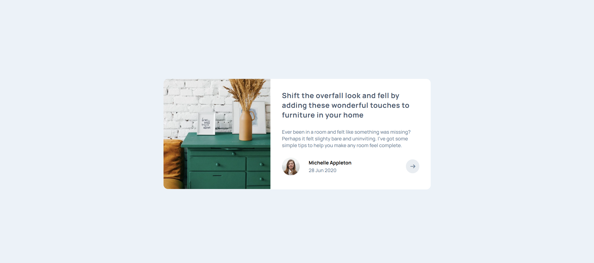

<h1 align="center">Article preview component</h1>

###

  
  
  
  
  

###

📝 Brief Your challenge is to build out this article preview component and get it looking as close to the design as possible.  You can use any tools you like to help you complete the challenge. So if you've got something you'd like to practice, feel free to give it a go.  The only JavaScript you'll need for this challenge is to initiate the share options when someone clicks the share icon.  Your users should be able to:  See the social media share links when they click the share icon View the optimal layout for each page depending on their device's screen size See hover states for all interactive elements on the page

###

https://www.frontendmentor.io/home

###

